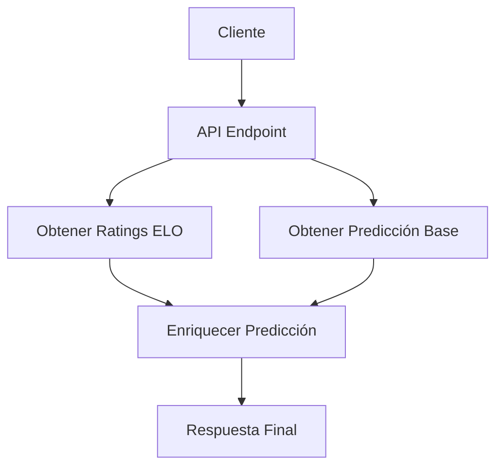
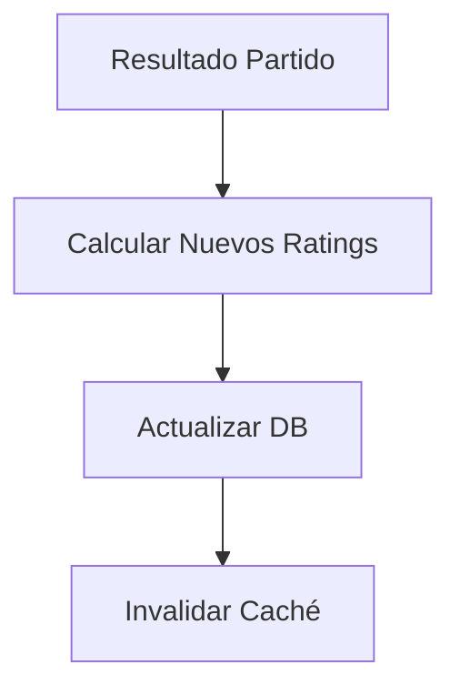

# Sistema de Predicción de Fútbol - Arquitectura e Implementación

## Componentes del Sistema

### 1. Motor de Predicción Core
- Módulo de predicción mejorada (`enhanced_predictions.py`)
- Integración de análisis táctico (`tactical_integration.py`)
- Integración de modelos de machine learning
- Procesamiento de datos en tiempo real
- Sistema de calibración automática
- Validación de predicciones

### 2. Gestión de Datos
- Adaptadores y backends de base de datos
- Sistema de gestión de caché
- Procedimientos de backup y recuperación
- Validación y limpieza de datos
- Sistema de migración de datos
- Monitoreo de integridad

### 3. Capa de API
- Endpoints RESTful para predicciones
- Autenticación y autorización robusta
- Limitación de tasa y throttling
- Formateo de respuestas estandarizado
- Documentación automática
- Versionado de API

### 4. Herramientas de Análisis
- Monitoreo de rendimiento en tiempo real
- Seguimiento de errores y excepciones
- Análisis estadístico avanzado
- Evaluación de modelos
- Visualización de datos
- Reportes automatizados

### 5. Módulo de Rating ELO (`team_elo_rating.py`)
- Cálculo y actualización de ratings ELO
- Ajuste de ratings basado en resultados
- Recuperación de ratings desde la base de datos

## Guías de Implementación

### Esquema de Base de Datos
- Información de equipos y plantillas
- Datos históricos de partidos
- Historial de predicciones
- Métricas de rendimiento
- Análisis tácticos
- Datos de formaciones

### Endpoints de API
- Predicciones de partidos
- Estadísticas de equipos
- Datos históricos y tendencias
- Estado del sistema
- Análisis táctico
- Métricas de confianza

### Configuración de Despliegue
- Configuración de entorno
- Gestión de dependencias
- Herramientas de monitoreo
- Procedimientos de backup
- Logs y auditoría
- Seguridad y cifrado

### Estrategia de Testing
- Tests unitarios automatizados
- Tests de integración
- Tests de carga y stress
- Benchmarks de rendimiento
- Testing de regresión
- Cobertura de código

## Integración de Componentes

### Procesamiento de Datos
- Pipeline de ingesta de datos
- Normalización y limpieza
- Validación y verificación
- Transformación y enriquecimiento
- Almacenamiento y backup
- Monitoreo de calidad

### Gestión de Modelos
- Entrenamiento automatizado
- Validación cruzada
- Ajuste de hiperparámetros
- Monitoreo de drift
- Versión de modelos
- Evaluación continua

### Sistema de Monitoreo
- Métricas en tiempo real
- Alertas configurables
- Dashboard de estado
- Logs centralizados
- Análisis de tendencias
- Reportes periódicos

## Flujos de Datos

### 1. Consulta de Predicción



### 2. Actualización de Ratings



## Detalles de Implementación

### Cálculo de Probabilidades ELO

1. Diferencia de Rating Ajustada:
```python
adjusted_diff = home_elo - away_elo + HOME_ADVANTAGE
```

2. Probabilidad de Victoria:
```python
win_prob = 1 / (1 + 10 ** (-adjusted_diff / 400))
```

3. Ajuste Post-Partido:
```python
new_rating = old_rating + K_FACTOR * (actual_result - expected_result)
```

### Blend de Predicciones

El sistema usa un mecanismo de blend ponderado:

```python
def blend_predictions(model_pred, elo_pred, weight=0.3):
    return {
        'win_prob': (1-weight)*model_pred + weight*elo_pred,
        'confidence': calculate_blend_confidence()
    }
```

## Optimizaciones

### 1. Caché de Ratings

- Implementación de caché en memoria para ratings frecuentes
- Invalidación selectiva por equipo/liga
- TTL configurable por tipo de dato

### 2. Batch Updates

- Actualización batch de ratings post-jornada
- Recálculo periódico de factores de ajuste
- Compresión de histórico de ratings

## Monitoreo y Mantenimiento

### Logs y Métricas

```python
logger.info({
    'prediction_id': pred_id,
    'elo_diff': elo_data['diff'],
    'confidence': prediction['confidence'],
    'processing_time': elapsed_time
})
```

### Health Checks

- Validación periódica de ratings
- Monitoreo de tiempos de respuesta
- Alertas por anomalías en predicciones

## Configuración del Sistema

### Variables de Entorno

```bash
ELO_K_FACTOR=32
HOME_ADVANTAGE=100
CACHE_TTL=3600
BLEND_WEIGHT=0.3
```

### Parámetros Ajustables

- Factores K por liga/torneo
- Ventaja local por estadio
- Pesos de blend por tipo de competición
- Umbrales de confianza para predicciones
